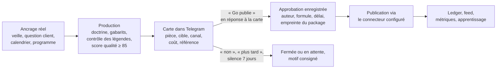
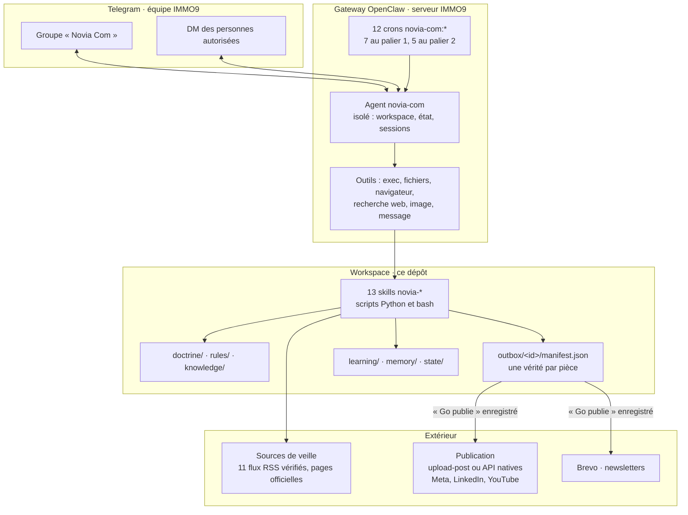

<div align="center">

# Novia Com

### L'agent OpenClaw de communication d'IMMO9

**Veille du marché du neuf chaque matin · contenus dans la voix d'IMMO9 pour quatre audiences · déclinaisons multi-format · mesure honnête · zéro publication sans « Go publie »**

    

</div>

---

## En une minute

Novia Com est un agent OpenClaw dédié au pôle communication d'IMMO9, promoteur et distributeur de logements neufs et VEFA à Toulouse, Bordeaux, Montpellier, Nantes et Rennes. Il s'installe sur un serveur OpenClaw existant comme un agent isolé, avec son propre workspace, son propre compte Telegram et ses propres tâches planifiées, sans toucher aux autres agents.

| | |
|---|---|
| **Ce qu'il fait** | Veille quotidienne sourcée, propositions de posts et carrousels, adaptation par persona, déclinaisons dans les formats des plateformes, infographie mensuelle, newsletters, podcast et audiograms, vidéo, reporting hebdomadaire et mensuel |
| **Ce qu'il ne fait jamais seul** | Publier, envoyer une newsletter, contacter un tiers, dépenser au-delà d'un plafond, citer un chiffre sans source ni date, promettre un rendement |
| **Ce que l'équipe garde** | Deux validations par pièce au maximum : « Go » sur la proposition, « Go publie » sur le package final, dans Telegram |
| **Périmètre couvert** | Les 32 fonctionnalités demandées par IMMO9 (mail du 22 mai 2026), tracées une à une dans [la matrice](docs/MATRICE-FONCTIONNALITES.md) : 15 livrées, 5 livrées avec un connecteur à brancher, 9 au palier 2, 3 en feuille de route |
| **Installation** | Une heure avec le [prompt Claude Code](docs/PROMPT-CLAUDE-CODE.md) ou le [guide pas à pas](docs/INSTALLATION.md), puis quelques jours d'onboarding avec l'équipe |
| **Mises à jour** | `bash scripts/update.sh` chaque semaine ; vos fichiers d'état et de mémoire ne sont jamais écrasés |

---

## Sommaire

1. [Ce que Novia Com fait, domaine par domaine](#1-ce-que-novia-com-fait-domaine-par-domaine)
2. [Comment elle travaille](#2-comment-elle-travaille)
3. [Architecture](#3-architecture)
4. [Ce que contient le dépôt](#4-ce-que-contient-le-dépôt)
5. [Les 13 skills](#5-les-13-skills)
6. [Les 12 tâches planifiées](#6-les-12-tâches-planifiées)
7. [Installation](#7-installation)
8. [Sécurité et limites, sans détour](#8-sécurité-et-limites-sans-détour)
9. [Comment ce paquet a été construit et vérifié](#9-comment-ce-paquet-a-été-construit-et-vérifié)
10. [Feuille de route](#10-feuille-de-route)
11. [Documentation et contact](#11-documentation-et-contact)

---

## 1. Ce que Novia Com fait, domaine par domaine

Les trois régimes reprennent le vocabulaire de la liste de besoins d'IMMO9. **Auto** : l'agent fait et livre dans le groupe Telegram, jamais vers l'extérieur. **Semi-auto** : l'agent produit une pièce complète, la présente en une carte, attend le « Go ». **Assistant** : à la demande, dans la conversation.

| Domaine | Ce que l'agent produit | Régime | Rythme |
|---|---|---|---|
| **Veille et analyse** | Digest du matin (marché du neuf, réglementaire et fiscal, presse nationale et locale des cinq villes, concurrents, questions Reddit), rapport hebdomadaire des tendances, chaque ligne datée et sourcée | Auto | Quotidien, hebdomadaire |
| **Création éditoriale** | Posts (au plus deux propositions par jour), adaptation par persona, variantes d'accroches pour tests A/B, transformation long vers court, campagnes thématiques, calendrier éditorial | Semi-auto, Auto, Assistant | Quotidien à trimestriel |
| **Création visuelle** | Carrousels pédagogiques LinkedIn et Instagram, déclinaisons 9:16, 1:1, 16:9 et 1.91:1, infographie mensuelle taux et prix, bannières, gabarits, miniatures YouTube A/B | Semi-auto, Auto | Hebdomadaire, mensuel, à la demande |
| **Audio et podcast** | Script d'épisode, transcription et show notes, audiograms 1:1 et 9:16 avec forme d'onde | Semi-auto, Auto | Bimensuel, à chaque épisode |
| **Vidéo** | Vidéos courtes à partir d'infographies (HyperFrames), montage de rushes d'interviews avec sous-titres mot à mot (supermonteur) | Semi-auto | À la demande |
| **Newsletters** | Quatre segments (primo-accédants, investisseurs, promoteurs, partenaires), HTML lisible partout, désinscription obligatoire, envoi via Brevo en brouillon | Semi-auto | Bimensuel à mensuel |
| **Performance** | Reporting hebdomadaire et mensuel par plateforme, recommandations liées à des observations, heures de publication quand les données existent | Auto, Assistant | Hebdomadaire, mensuel |
| **Relation et partenariats** | Identification d'influenceurs et partenaires immobiliers, fiche par candidat, aucun contact sans validation | Assistant | Mensuel |

Le détail ligne par ligne, avec le statut de chacune des 32 exigences : [docs/MATRICE-FONCTIONNALITES.md](docs/MATRICE-FONCTIONNALITES.md).

---

## 2. Comment elle travaille

### Le cycle d'une pièce



### Les règles qui ne se négocient pas

- **Deux validations par pièce au maximum.** La leçon vient d'un studio de contenu qui exigeait six validations par pièce : l'adoption s'effondre. Ici, « Go » sur la proposition, « Go publie » sur le package final, et rien d'autre.
- **Une approbation est un message seul, en réponse à la carte, par une personne de la liste autorisée.** Un pouce, un « ok », une question, une phrase conditionnelle ou une formule noyée dans du texte ne valent rien. Les scripts enregistrent l'auteur, l'horodatage, le texte, les identifiants Telegram du message et l'empreinte du package (légendes, titre, persona, fichiers dans l'ordre, canaux, plafond). Si le package change après validation, la publication est refusée.
- **Faits sourcés et datés.** Un taux, un plafond, une date d'entrée en vigueur portent leur source et leur date, ou disparaissent. La base de connaissance donne un niveau de confiance par dispositif et interdit de citer en dessous du niveau officiel.
- **Conformité immobilier intégrée.** Aucune promesse de rendement ou de plus-value, mention des risques sur tout contenu investisseur, aucune urgence fabriquée, aucune donnée client, aucun visuel généré présenté comme une photo réelle, RGPD sur les newsletters. Un contrôle machine des légendes refuse ce qui déroge.
- **Coûts annoncés avant d'être engagés.** Plafond par pièce et par mois dans le contrat machine ; les tâches planifiées ne dépensent jamais.
- **Verrou d'onboarding.** Tant que l'onboarding en cinq actes n'est pas terminé, l'agent lit, analyse et écrit sa doctrine, mais ne présente rien de publiable.

### L'onboarding en cinq actes

| Acte | Avec qui | Ce qui est produit |
|---|---|---|
| 0 · Diagnostic | Julien | Ce qui marche, ce que le studio ajoute, ce qui manque (connecteurs, clés, charte) |
| 1 · Identité et équipe | David, Julien | Nom, ton, personnes autorisées, canal de travail, plafonds de coût |
| 2 · Voix | Équipe communication | `doctrine/VOICE.md` extrait des publications réelles d'IMMO9, jamais d'un questionnaire ; lexique banni |
| 3 · Lignes rouges, personas, formats, charte | David, équipe | `LINES.md`, `PERSONAS.md`, `FORMATS.md`, tokens de charte, salons confirmés, concurrents, presse locale |
| 4 · Calibration | Équipe communication | Trois pièces test gratuites corrigées ensemble, puis passage à `complete` et activation des crons du palier 1 |

---

## 3. Architecture



**Où vit quoi.** Ce qui est versionné dans le dépôt se met à jour par `git pull` : charte, doctrine, connaissance, skills, gabarits, fragment de configuration, manifeste des crons, scripts, documentation. Ce qui est propre à l'installation ne l'est pas et n'est jamais écrasé : personnes autorisées, canaux, état d'onboarding, tokens de charte, mémoire, apprentissage, pièces produites. Les secrets vivent dans l'environnement du gateway et n'entrent ni dans le dépôt, ni dans le workspace, ni dans les crons. Détail : [docs/ARCHITECTURE.md](docs/ARCHITECTURE.md).

---

## 4. Ce que contient le dépôt

```
immo9-novia-com/
├── workspace/                 le workspace de l'agent, tel qu'OpenClaw le charge
│   ├── AGENTS.md              charte opérationnelle : régimes, cycle d'une pièce, règles dures, routage, crons, mémoire
│   ├── SOUL.md · IDENTITY.md · TEAM.md · HEARTBEAT.md · BOOT.md
│   ├── rules/                 9 procédures : autonomie, validation, conformité immobilier, veille, visuel, mémoire, coûts, crons, réponses
│   ├── doctrine/              10 documents : voix, lignes rouges, personas, formats, légendes par plateforme, charte,
│   │                          qualité narrative, calendrier, sources, contrat machine (STUDIO_CONTRACT.json)
│   ├── knowledge/             glossaire neuf et VEFA, dispositifs 2026 avec niveaux de confiance, 22 sources de veille,
│   │                          calendrier des marronniers, villes, banque de questions, lexique banni, données de marché
│   ├── skills/                13 skills novia-* avec leurs scripts (stdlib Python 3.8+ et bash, aucune dépendance à installer)
│   ├── templates/             gabarits HTML pilotés par les tokens de charte : carrousel, infographie, newsletter, miniatures
│   └── state/ · learning/ · outbox/ · export/ · memory/   propres à chaque installation (exemples fournis)
├── skills-shared/             6 skills réutilisables relus pour Linux, et la liste des skills à prendre à leur source publique
├── config/                    fragment de configuration OpenClaw (sans secret) et exemple de variables d'environnement
├── crons/                     manifeste des 12 tâches planifiées et leur installateur idempotent
├── scripts/                   install.sh · doctor.sh · acceptance.sh · update.sh · prepare_patch.py
├── connectors/                ce que l'équipe technique branche : Telegram, publication, newsletter, analytics, veille
├── docs/                      installation, prompt Claude Code, architecture, matrice, feuille de route, sécurité, mémoire,
│                              état de l'art sourcé, limites connues
└── CHANGELOG.md
```

<details>
<summary><strong>La doctrine, document par document</strong></summary>

| Document | Rôle | Rempli par |
|---|---|---|
| `LINES.md` | Lignes rouges : ce qui ne sort jamais, ce qui demande un accord, sujets interdits, règles de vérité. Préséance sur tout. | Sectoriel livré, propre à IMMO9 à l'acte 3 |
| `VOICE.md` | Rythme, ouvertures, finitions, lexique signature et banni, registres par surface | Extrait du corpus réel à l'acte 2 |
| `PERSONAS.md` | Primo-accédants, investisseurs, promoteurs, partenaires : situations, questions réelles, mots à utiliser et à éviter | Hypothèses livrées, enrichies à l'acte 3 |
| `FORMATS.md` | Neuf formats F1 à F9 : intention, surface, canevas, métrique primaire, régime | Livré |
| `CAPTIONS_MATRIX.md` | Limites et règles natives par plateforme, transformation d'un même contenu, interdits | Livré |
| `BRAND_SYSTEM.md` | Tokens de charte, règles de composition, interdits visuels, cohérence de feed | Acte 3 |
| `NARRATIVE_QUALITY.md` | Promesse d'une pièce, registre de vérité, dix contrôles, scorecard sur 100, conformité | Livré |
| `CALENDRIER_EDITORIAL.md` | Échéances réglementaires et fiscales, rythme du marché, salons, séquences de contenu | Livré, salons confirmés à l'acte 3 |
| `SOURCES_VEILLE.md` | Niveaux de confiance des sources, règles de citation | Livré |
| `STUDIO_CONTRACT.json` | Invariants machine : formats, mots d'approbation, délais, plafonds de coût, crons, conformité, onboarding | Livré, plafonds confirmés à l'acte 1 |

</details>

<details>
<summary><strong>La base de connaissance</strong></summary>

- `glossaire-neuf-vefa.md` : achat sur plan, contrat de réservation, appels de fonds, livraison, les six garanties du neuf, notions fiscales, énergie, acteurs.
- `dispositifs-2026.md` : prêt à taux zéro, statut du bailleur privé, logement locatif intermédiaire, TVA réduite en zones ANRU, exonération de droits de donation, calendrier DPE, loi de finances 2026, frais de notaire, taxe foncière. **Chaque item porte un niveau de confiance (élevé, moyen, faible), les contradictions relevées entre sources et les points à vérifier avant publication.** L'agent ne cite qu'au niveau officiel.
- `sources-veille.json` : 22 sources autorisées (officiel, professionnel, presse nationale et locale), dont 11 flux RSS vérifiés par HTTP le 14 septembre 2026, et le dispositif d'alertes Google en RSS pour les mentions de marque.
- `calendrier-marronniers.json` : échéances récurrentes et salons, avec un statut confirmé ou indicatif.
- `villes.md`, `questions-audience.md`, `lexique-banni.json`, `donnees-marche.json`, `concurrents.json`.

</details>

---

## 5. Les 13 skills

Chaque skill est un dossier `SKILL.md` plus scripts, chargé automatiquement par OpenClaw depuis le workspace. Les scripts n'utilisent que la bibliothèque standard de Python et `ffmpeg` : rien à installer, tout se diagnostique.

| Skill | Ce qu'il fait | Scripts | Régime |
|---|---|---|---|
| `novia-onboarding` | Les cinq actes, le verrou de production, l'avancement séquentiel vérifié | `onboarding_state.py` | Assistant |
| `novia-outbox` | Manifest par pièce, présentation, enregistrement des approbations (auteur, formule exacte, délai, carte, chat, empreinte du package), statuts et ledger | `outbox_new.py`, `outbox_present.py`, `outbox_approve.py`, `outbox_set.py`, `outbox_status.py` | Interne |
| `novia-publish` | Publication après « Go publie » uniquement : verrou par pièce, empreinte vérifiée, états distincts (publiée, soumise, brouillon distant, issue inconnue), reprise sans doublon, export des seuls médias à exposer, aperçu sans envoi | `publish.py` + 6 adaptateurs : `dryrun`, `upload_post`, `meta_graph`, `linkedin`, `youtube`, `brevo` | Go 2 obligatoire |
| `novia-editorial` | Posts, adaptation par persona, variantes d'accroches, long vers court, campagnes, brouillons de réponses forums ; contrôle machine des légendes (limites, mots bannis, promesses, urgence, tutoiement, sources, risques) | `caption_check.py` | Semi-auto, Auto |
| `novia-carousel` | Carrousel 5 à 8 slides depuis un JSON, HTML à la charte, rendu PNG et PDF par navigateur headless | `carousel_build.py`, `render_html.sh` | Semi-auto |
| `novia-declinaison` | Un master, quatre surfaces : 9:16, 1:1, 16:9, 1.91:1, recadrage ou fond flouté, images et vidéos | `declinaison.sh` | Auto |
| `novia-veille` | Lecture des flux RSS et pages autorisées, filtre thématique, dédoublonnage, digest ; Reddit en lecture OAuth optionnelle | `veille_rss.py`, `reddit_scan.py` | Auto |
| `novia-calendrier` | Échéances à venir, récurrences, séquences annonce, pédagogie, rappel, bilan | `calendrier_next.py` | Assistant, cron |
| `novia-infographie` | Infographie mensuelle taux et prix, refuse tout chiffre sans source et date | `infographie_build.py` | Auto (brouillon) |
| `novia-newsletter` | HTML email-safe 640 px, version texte, mention des risques pour les investisseurs, désinscription obligatoire | `newsletter_build.py` | Semi-auto |
| `novia-podcast` | Script, voix, montage, transcription et show notes, audiograms avec forme d'onde | `audiogram.sh` | Semi-auto, Auto |
| `novia-video` | Vidéos courtes HyperFrames, montage de rushes sous-titré, miniatures YouTube A/B | gabarits `templates/miniature/` | Semi-auto |
| `novia-reporting` | Ingestion des exports CSV sans doublon, bilan par pièce et par canal, recommandations sous condition d'observations suffisantes | `metrics_ingest.py`, `weekly_digest.py` | Auto, Assistant |

**Skills partagés livrés** (installés pour tous les agents du serveur, relus et nettoyés pour Linux) : `html-email`, `elevenlabs-soundfx`, `sound-integration`, `reddit-search`, `nano-banana-pro`, `supermonteur`. **Skills référencés par leur source publique** : HyperFrames, last30days, mermaid, video, content-marketing, content-ideas, instagram. Liste et commandes : [skills-shared/INSTALL.md](skills-shared/INSTALL.md).

---

## 6. Les 12 tâches planifiées

Déclarées de façon idempotente par clé (`novia-com:<clé>`), livrées désactivées, activées par `bash crons/install-crons.sh --enable-p1` à la fin de l'onboarding. Chaque tâche commence par lire l'état d'onboarding et se tait si rien ne mérite l'attention de l'équipe. Aucune ne publie ni ne dépense.

| Tâche | Quand (Europe/Paris) | Palier | Sortie |
|---|---|---|---|
| Veille du matin | Lundi à vendredi 7h30 | 1 | Digest de 3 à 6 lignes, sourcé |
| Proposition du jour | Lundi à vendredi 9h00 | 1 | Au plus deux cartes de posts ancrés |
| Comité éditorial | Lundi 8h30 | 1 | Plan de la semaine en une carte |
| Veille hebdomadaire | Vendredi 16h00 | 1 | Concurrents, tendances, formats |
| Rapport hebdomadaire | Lundi 9h30 | 1 | Cinq lignes sur les publications et métriques |
| Boucle d'apprentissage | Lundi 20h30 | 1 | Fichiers `learning/` mis à jour, propositions de doctrine |
| Santé | Tous les jours 6h00 | 1 | Silence si tout va bien |
| Infographie mensuelle | Le 2 du mois | 2 | Brouillon taux et prix |
| Newsletter | Le 1er et le 15 | 2 | Brouillon par persona |
| Préparation podcast | Un vendredi sur deux | 2 | Script à valider |
| Rapport mensuel | Le 3 du mois | 2 | Bilan, coût réel, recommandations |
| Mois suivant | Le 25 du mois | 2 | Échéances et marronniers à anticiper |

---

## 7. Installation

**Prérequis** : OpenClaw 2026.9.1 ou plus récent, `python3` 3.8+, `ffmpeg`, `git` ; recommandés `chromium` (rendu des visuels) et `node` 18+ (HyperFrames, supermonteur).

**Avec Claude Code sur le serveur**, coller le prompt de [docs/PROMPT-CLAUDE-CODE.md](docs/PROMPT-CLAUDE-CODE.md). Il commence par une étape zéro de vérifications (système, version, gateway, agents et comptes existants, outils, réseau, tests hors ligne), rend un tableau de compatibilité, pose onze questions adaptées à votre environnement (mise à jour, Telegram, modèles, connecteur de publication, newsletter, mémoire, rendu, métriques, coûts, périmètre, charte), puis guide chaque étape sans rien écrire sans confirmation.

**En six étapes, à la main** ([docs/INSTALLATION.md](docs/INSTALLATION.md)) :

1. `git clone` puis `bash scripts/doctor.sh` : diagnostic de la machine.
2. Bot Telegram « Novia Com », groupe de travail, identifiants des personnes autorisées ; `workspace/state/approvers.json` et `channels.json` remplis depuis les exemples.
3. Variables d'environnement (`config/env.example`, au minimum le jeton du bot) dans l'environnement du gateway et du shell.
4. `bash scripts/install.sh` en simulation, puis `--apply` : agent isolé, compte Telegram (jeton référencé, jamais copié), configuration fusionnée, skills partagés, crons déclarés. Sauvegarde avant d'écrire, rejouable, refuse les identifiants d'exemple.
5. Dans Telegram : « Commençons l'onboarding ».
6. À la fin de l'onboarding : `bash crons/install-crons.sh --enable-p1`, puis une première publication avec « Go publie ».

Chaque semaine : `bash scripts/update.sh`. Vérifications utiles : `openclaw agents list --bindings`, `openclaw skills check --agent novia-com`, `bash scripts/acceptance.sh`.

---

## 8. Sécurité et limites, sans détour

- **Aucun secret** dans le dépôt, le workspace ou les crons. Jeton Telegram en référence d'environnement, variables des connecteurs injectées seulement si elles existent, jamais affichées.
- **Isolation de l'agent** : workspace, état et sessions propres ; compte Telegram dédié en allowlist de personnes et de groupe ; politique d'outils par agent ; aucun accès au CRM ni à la mémoire des autres agents.
- **Portée réelle des verrous.** Les vérifications d'approbation, de publication et d'onboarding sont des scripts que l'agent exécute. Elles arrêtent l'erreur et la validation non autorisée, et refusent tout contenu modifié après validation. Elles n'arrêteraient pas un agent qui contournerait ses propres scripts : il a l'exécution de commandes et l'écriture de son workspace. L'isolation complète, un publisher séparé sous un autre utilisateur système, seul détenteur des jetons, est la première priorité du palier 2. En attendant, le groupe Telegram voit chaque publication annoncée.
- **Ce qui n'a pas été testé dans ce dépôt** : une conversation Telegram avec un bot réel, une publication réelle sur une plateforme, les crons sur un gateway de production. C'est ce que l'étape zéro du prompt et la première publication test couvrent chez IMMO9.

Détail : [docs/SECURITE.md](docs/SECURITE.md), [docs/LIMITES.md](docs/LIMITES.md).

---

## 9. Comment ce paquet a été construit et vérifié

Ce dépôt a été conçu, écrit et vérifié le 14 septembre 2026 par Gil Benittah avec un pipeline outillé. Chaque étape a laissé une trace.

**Cadrage.** Point de départ : la liste de 32 fonctionnalités envoyée par IMMO9 le 22 mai 2026, six domaines, avec les niveaux d'autonomie souhaités. Le paquet reprend le modèle d'un studio de contenu déjà en production (charte, doctrine, contrat machine, gates de qualité, boucle d'apprentissage), transposé au métier du neuf et de la VEFA et au cadre OpenClaw.

**Recherche.** Huit recherches multi-moteurs (Google, Brave, Exa, Linkup, Perplexity, Firecrawl, plus le pouls social sur trente jours), plus de soixante sources uniques par requête, dépouillées source par source par deux agents indépendants : état de l'art des agents IA en communication immobilière, connecteurs de publication et leurs tarifs relus en direct, analytics et social listening, pratiques communautaires OpenClaw, dispositifs immobiliers 2026, salons, sources de veille. Ce qui n'était pas sourcé au niveau officiel a été marqué comme tel ; les chiffres marketing invérifiables ont été écartés et listés. Résultat : [docs/ETAT-DE-L-ART.md](docs/ETAT-DE-L-ART.md) et `knowledge/`.

**Vérifications de terrain.** Pages de documentation OpenClaw lues et commandes confirmées sur la version 2026.9.4 ; flux RSS candidats testés un à un par HTTP (11 retenus, dont BOFiP et FPI en officiel) ; audit de portabilité Linux de 34 skills existants (chemins personnels, dépendances, binaires macOS) avant d'en retenir 6 et d'en référencer 7 ; schéma de configuration extrait de la CLI pour les comptes et groupes Telegram.

**Tests.** `scripts/acceptance.sh` rejoue 84 tests hors ligne sur une copie complète du dépôt : hygiène (aucun chemin personnel, aucun secret, JSON valides, scripts compilés), génération de la configuration Telegram et des crons avec un OpenClaw simulé, verrou d'onboarding, quinze cas d'approbation refusés (personne non autorisée, pouce, question, condition, formule noyée, autre chat, package modifié, titre, persona, objet), publication (canal non approuvé, verrou, réponse illisible, refus serveur, issue inconnue, reprise sans doublon, réparation des traces), contrôles éditoriaux, production (carrousel, infographie, newsletter, déclinaisons, reporting). L'installation complète a été exécutée sur un profil OpenClaw jetable : agent, configuration, compte Telegram, binding, changement de groupe, skills partagés, tous les skills visibles. Les rendus (carrousel, infographie, déclinaisons, audiogram) ont été contrôlés visuellement.

**Relectures à froid par un second modèle.** Cinq passes adversariales de GPT-6 Astra sur le dépôt entier, avec exécution de reproductions ciblées. Scores : 48, 68, 76, 82, 84 sur 100. Chaque passe a produit des défauts réels, tous corrigés et couverts par un test : configuration Telegram (les groupes se déclarent dans `groups`, pas dans l'allowlist des utilisateurs), crons découpés par un retour à la ligne, approbation non liée au package puis au message, faux succès sur une réponse asynchrone, resoumission après un délai d'attente, verrou acquis trop tard, fichiers locaux versionnés, comptage des fonctionnalités, et une dizaine de points de second ordre. Le point de fond restant, l'isolation système, est documenté comme limite de la version 1 plutôt que masqué.

**Livraison.** Dépôt privé, historique de commits explicite, journal des versions, prompt d'installation guidée, et un mail de démarche avec ce prompt intégré.

---

## 10. Feuille de route

| Palier | Contenu | État |
|---|---|---|
| **1** | Veille, posts, carrousels, déclinaisons, calendrier, approbations, publication, reporting sur exports, apprentissage, santé | Livré, actif après l'onboarding |
| **2** | Infographie, newsletters, podcast et audiograms, vidéo et montage, miniatures, rapport mensuel, bannières, manques Wikipédia | Livré, activé à la demande ou quand la dépendance est branchée |
| **2, priorité** | Publisher isolé : service séparé sous un autre utilisateur, seul détenteur des jetons, vérification des approbations côté gateway | À construire |
| **3** | Connecteurs analytics par API, tendances via fournisseur (Google Trends, People Also Ask), part de voix, Quora et forums, recherche multi-moteurs approfondie, nœud de rendu, mémoire partagée (memory-rag ou GBrain) | À décider avec IMMO9 |

Détail : [docs/ROADMAP.md](docs/ROADMAP.md).

---

## 11. Documentation et contact

| Document | Contenu |
|---|---|
| [docs/INSTALLATION.md](docs/INSTALLATION.md) | Installation pas à pas, vérifications, désinstallation |
| [docs/PROMPT-CLAUDE-CODE.md](docs/PROMPT-CLAUDE-CODE.md) | Le prompt d'installation guidée, avec vérifications préalables et questions |
| [docs/ARCHITECTURE.md](docs/ARCHITECTURE.md) | Schémas, cycle d'une pièce, où vit quoi |
| [docs/MATRICE-FONCTIONNALITES.md](docs/MATRICE-FONCTIONNALITES.md) | Les 32 exigences, une par ligne, avec leur statut |
| [connectors/README.md](connectors/README.md) | Telegram, publication, newsletter, analytics, veille : ordre conseillé, tarifs relus, points de vigilance |
| [docs/SECURITE.md](docs/SECURITE.md) · [docs/LIMITES.md](docs/LIMITES.md) | Secrets, isolation, portée des verrous, limites connues |
| [docs/MEMOIRE.md](docs/MEMOIRE.md) | Mémoire de l'agent et branchement d'une couche mémoire externe |
| [docs/ETAT-DE-L-ART.md](docs/ETAT-DE-L-ART.md) | État de l'art sourcé, septembre 2026 |
| [docs/ROADMAP.md](docs/ROADMAP.md) · [CHANGELOG.md](CHANGELOG.md) | Paliers et journal des versions |

**Gil Benittah** · iformy.gil@gmail.com · conception, développement et maintenance hebdomadaire de Novia Com pour IMMO9.
