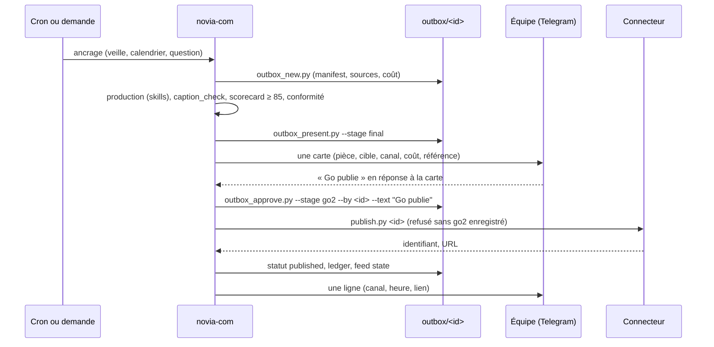

# Architecture

## Vue d'ensemble
```mermaid
flowchart LR
  subgraph Telegram["Telegram (équipe IMMO9)"]
    G[Groupe « Novia Com »]
    DM[DM des personnes autorisées]
  end
  subgraph OC["Gateway OpenClaw (serveur IMMO9)"]
    A[Agent novia-com<br/>workspace = ce dépôt/workspace]
    C[Crons novia-com:*]
    T[Outils : exec, fichiers, web_search, web_fetch, browser, image, message]
  end
  subgraph WS["Workspace"]
    D[doctrine/ · rules/ · knowledge/]
    S[skills/novia-*]
    O[outbox/&lt;id&gt;/manifest.json]
    L[learning/ · memory/ · state/]
  end
  subgraph EXT["Extérieur"]
    V[Sources de veille RSS et pages officielles]
    P[Connecteur de publication<br/>upload-post ou APIs natives]
    N[Brevo (newsletter)]
  end
  G <--> A
  DM <--> A
  C --> A
  A --> T
  T --> S
  S --> D
  S --> O
  S --> L
  S --> V
  O -->|« Go publie » enregistré| P
  O -->|« Go publie » enregistré| N
```

## Le cycle d'une pièce


## Où vit quoi
| Élément | Emplacement | Versionné dans le dépôt |
|---|---|---|
| Charte, doctrine, connaissance, skills, gabarits | `workspace/` | oui : mis à jour par `git pull` |
| État de l'installation (personnes, canaux, onboarding) | `workspace/state/*.json` | non (exemples versionnés) |
| Pièces produites, journal, apprentissage | `workspace/outbox/`, `memory/`, `learning/` | non |
| Configuration OpenClaw de l'agent | `openclaw.json` du serveur (fragment dans `config/`) | fragment oui, config non |
| Crons | base d'état OpenClaw (manifeste dans `crons/crons.json`) | manifeste oui |
| Secrets | environnement du service gateway | jamais |
| Skills partagés | dossier managé d'OpenClaw (`skills-shared/` comme source) | oui |

## Principes
- **Un seul agent, isolé** : workspace, répertoire d'état et compte Telegram propres ; aucun accès aux autres agents ni aux portefeuilles clients.
- **Les verrous sont dans le code** : approbation vérifiée par script (auteur, texte, délai), publication impossible sans enregistrement, onboarding fail-closed, coûts plafonnés par contrat, politique d'outils dans la configuration.
- **Une seule vérité par pièce** : le manifest. Les crons et les scripts y écrivent ; l'agent ne « se souvient » pas d'une validation, il la lit.
- **Mise à jour sans perte** : ce qui est versionné se met à jour, ce qui est local ne bouge pas.
